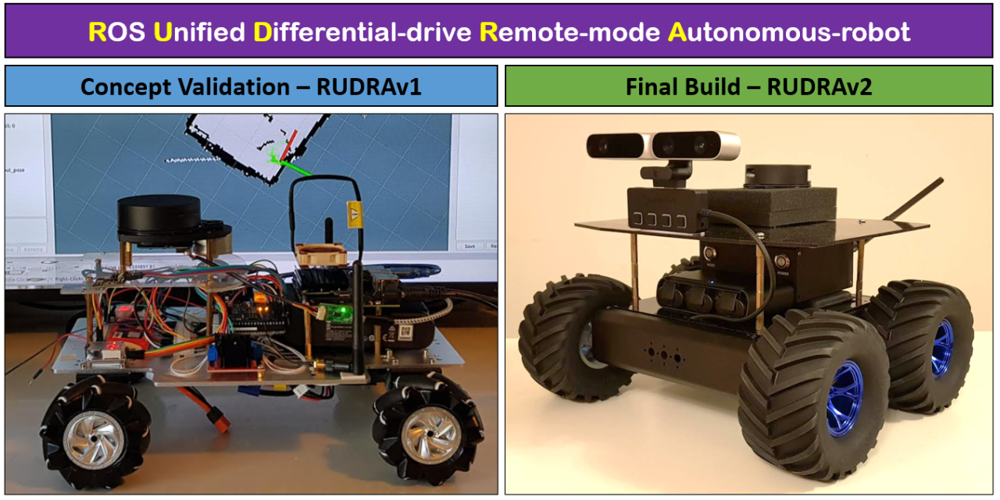
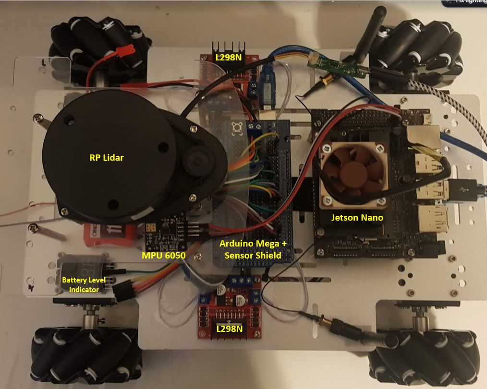
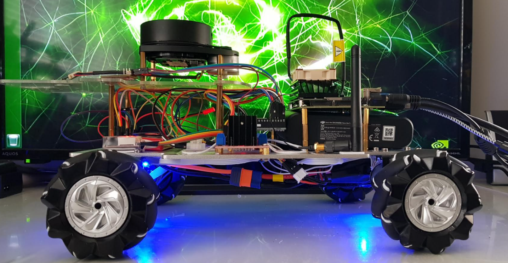

I always wanted to build an autonomous robot from scratch that is capable of Simultaneous Localization And Mapping (SLAM) and Path Planning. Beginning of 2021, I started exploring various concepts and here in this article, I will try to cover the main aspects of the robot hardware, build, and the codes that I ended up implementing.

My GitHub repositories that complement this article:

RUDRAv1: https://github.com/AdzTheDemon/RUDRAv1

RUDRAv2 https://github.com/AdzTheDemon/RUDRAv2

My Requirements for the project:

Design, develop, and build a SLAM autonomous robot capable of mapping, planning, and autonomous navigation.
The robot will be equipped with a Depth and IR camera for object detection, reinforcement learning, and deep learning tasks.
Modular approach in architecture to enable upgrade and scalability.
Should be able to switch between manual and autonomous control of robot base on demand.
Under 500 USD.
Architecture Exploration:

After reviewing several different ways to go about it, I settled for the below hardware-software stack.

1. Kinematics: Differential 4-wheel drive

2. Perception Layer:

   - Lidar - RPLidar

   - Depth Camera

   - IR camera 

   - IMU - MPU6050

3. SLAM layer:

   - ROS Melodic as the middleware - Navigation Stack, Rosserial, RPLidar and gmapping

   - Jetson Nano operating on Ubuntu 18.04

   - Battery pack for Jetson Nano

4. Base Layer:

   - A suitable microcontroller - Arduino/ Teensy

   - Motor drivers

   - 12v DC motors

   - 12v Lipo batteries

   - PS2 controller for manual control of the robot.

## RUDRAv1: Concept Validation & Prototype

I went for a very basic hardware configuration to prove that my planned architecture indeed works and learn from the experience to build a better base mostly using the same sensors used on the prototype. Following are the hardware I used to build the Architecture:

1. 4x 300 rpm [12V motors](https://www.aliexpress.com/item/4001062487473.html?spm=a2g0s.9042311.0.0.74e34c4du4o9UG) with encoders

2. Microcontroller

   - [Arduino Mega](https://www.amazon.ca/Elegoo-Board-ATmega2560-ATMEGA16U2-Arduino/dp/B01H4ZLZLQ/ref=sr_1_1_sspa?dchild=1&keywords=Arduino+Mega&qid=1619934245&sr=8-1-spons&psc=1&spLa=ZW5jcnlwdGVkUXVhbGlmaWVyPUFaMzhDM0NRVDJVT1YmZW5jcnlwdGVkSWQ9QTA2NDU2ODMzT1Q2NjlBREJQOVBWJmVuY3J5cHRlZEFkSWQ9QTA0NzI1MDAyMk5OTVhXSThaRERTJndpZGdldE5hbWU9c3BfYXRmJmFjdGlvbj1jbGlja1JlZGlyZWN0JmRvTm90TG9nQ2xpY2s9dHJ1ZQ==) connected to Jetson Nano over Rosserial

   - [Sensor Shield](https://www.amazon.ca/KEYESTUDIO-MEGA-Sensor-Shield-V1/dp/B0169YXYEY/ref=sr_1_4?crid=1ZAD7FXC7RMDX&dchild=1&keywords=arduino+mega+sensor+shield&qid=1619934266&sprefix=Arduino+Mega+senso%2Caps%2C192&sr=8-4) connected to Mega – to enable easier connections to motor encoders and sensors.

3. Motor Drivers

   - 2x [L298N](https://www.amazon.ca/PChero-2Packs-Controller-Stepper-Arduino/dp/B07C4B3DL4/ref=sr_1_7?crid=Q9XH0ZTWNE0T&dchild=1&keywords=l298n&qid=1619934370&sprefix=L29%2Caps%2C215&sr=8-7) Dual H Bridge Motor Driver

4. Perception Layer

   - [RPLidar](https://www.amazon.ca/Slamtec-RPLIDAR-Scanning-Avoidance-Navigation/dp/B07TJW5SXF/ref=sr_1_7?crid=EY9SGC2ZD5MG&dchild=1&keywords=rplidar+a1&qid=1619934486&sprefix=RPlid%2Caps%2C198&sr=8-7)

   - [MPU6050](https://www.robotshop.com/en/mpu6050-6-dof-gyro-accelerometer-imu.html)

This concept is highly inspired by [Sung’s](https://sungjik.wordpress.com/2015/09/28/my_personal_robotic_companion/) Personal Robotic Companion which is based on similar architecture as I had originally decided to proceed with. However, there are several differences and I have written my own source codes for implementation which can be found in my GitHub repository. 

Below are some images of the prototype:

After several iterations and fine-tuning, I managed to implement the following:

Arduino Code:

1)     PID control and tuning for 4 motors

  a.      The main loop in the Arduino converts encoder counts into the actual motor rpm of all 4 motors. The PID ensures that all motors have the same RPM at any given point in time.

  b.      This improves the Odometry very much but still I found that its not as accurate as I needed it to be.

2)     Subscribe to cmd_vel topic

  a.      The code subscribes to cmd_vel topic which sets the demanded speed for the motors m/s and also provides angular velocity for turning in rad/sec

  b.      The Arduino code converts the demand speed to individual wheel velocities and drive the robot base via the L298N bridge

3)     Publish Actual Wheel speeds

  a.      The wheel encoders provide counts per revolution of each wheel which can be used to determine the actual when RPM.

  b.      The actual wheel rpm is then published to ROS. The wheel speed is subscribed by the base control program running on Jetson Nano.

Jetson Nano Code:

1)     This portion of the code is pretty much taken from Sung’s implementation.

2)     The base_controller subscribes to the rpm topic from the Arduino and converts it into x velocity, theta velocity, xy position, and yaw. It also subscribes to the gyro topic from the android phone and combines the readings with the rpm information to produce combined yaw. The base controller then publishes this information in the form of odometry and tf messages.

Subscribed Topics : rpm(geometry_msgs::Vector3Stamped), gyro(geometry_msgs::Vector3)

Published Topics : odom(nav_msgs:Odometry)

Parameters:

– publish_tf : whether to publish tf or not. set to false if you want to use robot_pose_ekf

– publish_rate : rate in hz for publishing odom and tf messages

– linear_scale_positive : amount to scale translational velocity in the positive x direction

– linear_scale_negative : amount to scale translational velocity in the negative x direction

– angular_scale_positive : amount to scale rotational velocity counterclockwise

– angular_scale_negative : amount to scale rotational velocity clockwise

– alpha : value between 0 and 1, weight factor for wheel encoder yaw relative to gyro yaw

3)     IMU: While Sung went with an android device to sense gyro data, I used an MPU6050 to get all the raw data. MPU 6050 is connected to Jetson Nano GPIO. I decided to take this approach to implement MPU6050 and /imu/data_raw topic and use IMU Complementary node.

4)     Fusing IMU gyro data with the theta calculated from wheel odometry drastically improved the overall accuracy of localization. Hence, I decided to keep IMU sensing in the next version. I pretty much used the same complementary filter to achieve this in v1 but I intend to implement my version of Extended Kalman Filter in the next version.

No alt text provided for this image
Image: RUDRAv1 Mapping my room using the Lidar

RUDRAv2: The Final Build
Having learned several lessons from the first prototype, I knew exactly what I needed to improve on the next version:

The main reasons for building v2 from scratch were due to following reasons:

a.      Hardware limitations in accurately implementing mapping and eventually SLAM.

b.     I wanted to build a good reliable robot base so that I can then integrate different hardware and software stacks on it. For example, ROS-based Lidar SLAM, visual SLAM, Deep Learning, Reinforcement learning, GPS-based SLAM, etc.

c.      Bottom line, a good robot base becomes quintessential to be able to experiment with different concepts of Autonomous Navigation. Else a lot of time and effort is wasted in understanding what is going wrong...

d.     From the experience of working with Version 1, there were so many improvements that I wanted to implement that it wasn't possible to modify the v1 base but rather I had to build a new base ground up.

Major upgrades in Version 2

1)     Publish Odometry, IMU directly from Base Layer (on Teensy 4.1) Note: When using Teensy, the buffer size needs to be increased in the ros.h file to allow both Odometry and IMU topics to be published without errors.

 2)     Motors: The motors I was using on Version 1 were not good motors, the response of each motor was not repetitive for a given PWM signal... it was off by a huge margin... This could partly be due to the L298N motor driver inefficiencies. This resulted in a massive headache in tuning the PID values. Hence, bad odometry. Hence, very bad Localization. Upgraded to lower rpm (75 rpm) spur gear motor with good resolution encoders.

3)     Motor Driver: In Version 1, I was using 2x L298N motor driver. L298N is good for entry-level robot builds but it can only provide up to 1 Amp max current for each motor. Not that the motors draw 1 Amp continuous current but having extra power to the motor can be very helpful in demanding navigation situations. I upgraded to Sabertooth 2x12amp motor driver and I simply love this driver. It's loaded with amazing features.

4)     PWM vs Serial: In Version 1, I was driving the motors via PWM signal from Arduino Mega. This was not much of a problem but the Sabertooth has a unique feature where I can send the PWM integer value over Serial and the drive accurately implements it. In Version 2 I am using this approach. The good part is I can drive all 4 motors with a single physical wire and that makes the build a lot easier.

5)     Complementary Filter vs EKF: In version 1, I struggled to implement the EKF filter. I found that the complementary filter with 60% of theta coming from IMU and 40% from wheel odometry was giving me the best results. In version 2, with better hardware, I think I should get the EKF up and running.

6)     Arduino Mega vs Teensy 4.1: I have switched to Teensy 4.1 platform for Robot Base control, simply because it has huge memory compared to a Mega and this will help me measure and calculate PID, measure odometry, Measure IMU, and implement EKF right on the microcontroller itself rather than sending the raw data over to the Jetson Nano and process everything there. This also takes the load off the Jetson Nano which can be utilized to implement Laser or Visual Slam or any vision-based ANNs.

7)     MPU6050: This time I hooked up MPU6050 directly into the base layer. So that I can publish both /Odom and /imu/data_raw directly from Teensy 4.1. I noticed excessive noise in the IMU reading in version 1 so this time I mounted the MPU6050 in a small plastic project box infused with foam to provide some damping.

8)     Better Wheels: I noticed serious slippage with the Mecannum wheels I had on Version 1. This time I have some 135mm dia rubber wheels that look fantastic and provides some serious traction. Wheel slippage issue, bye-bye.

9)     Chassis: I upgraded the chassis to contain all the electronics securely. In version 1 it was exposed and I noticed that during trials when the bot hit the walls battery would fall off or some jumper wire would detach. So, I bought a standard off-the-shelf chassis.

For now, I haven't fully implemented the PS2 controller. The limitation of PS2 controller is that it seems to be working only on Arduino Uno. I had already made provisions to include an Uno in the base (see picture below). I need to figure out the best way to be to send raw PS2 data to Teensy or to the Jetson Nano. To the Teensy, I could use a serial communication Tx Rx link to send PS2 data. This approach seems somewhat challenging because I now need to modify the Teensy code to add another serial link (there are already two serial links running on Teensy, Serial0 for ROS to Jetson Nano and Serial1 for Sabertooth). The other option is that I publish a custom topic with a custom msg from Uno to the Jetson Nano controller. And Jetson Nano would then manipulate PS2 raw data to cmd_vel topic in Twist msg to Teensy. This is a work in progress.

Another concept I'm excited about is using the Adafruit NeoPixle LED strip. These are awesome and open up new possibilities to implement visual feedback of various processes working on RUDRA. Right now, just by looking at the Robot, I cannot tell if something is working or it failed. For example, if IMU failed to connect, I can make a LED blink RED to suggest that it failed and the IMU connects successfully, I could make a LED pulse in green.

Perhaps in the future, I could upgrade to Jetson Xavier NX which has the same footprint as that of Jetson Nano but is packed with humongous processing power. With Teensy 4.1 doing the heavy lifting in driving the robot base, it's a lot easier to simply change Jetson Nano to a Xavier or Intel NUC if need be, in the future. Modularity is key when you want to continuously improve your build.

The final implementation and launch files are available in my GitHub repository linked above.

Use the following steps to start mapping and navigation on RUDRAv2

The 'rudra' and 'rudra_description' ROS packages are installed on the robot, and everything is launched with the 'rudra_bringup.launch' file. This launches the ROS Serial node to talk to the Teensy 4.1, starts the laser, and also uses the Robot & Joint State Publishers to publish the transform in the URDF file so the laser is linked to the robot base in the right place.

On remote workstation:

The 'rudra_navigation' ROS package is installed on the remote workstation (although it could be run locally). You will also need to install the ROS navigation stack and slam_gmapping. You will also need to run rosdep to install any other dependencies: http://wiki.ros.org/rosdep

There is no launch file for gmapping, so having launched the rur_bringup package on the robot and launched Gmapping ( rosrun gmapping slam_gmapping scan:=scan ) you'll have to open Rviz and manually add/connect the topics for TF/Laser/Map etc. You can use the map server/saver command to save the map ( rosrun map_server map_saver -f ~/map )

After the map is complete you can launch the rur_navigation package which will open Rviz automatically. Use: roslaunch rur_navigation rur_navigation.launch map_file:=$HOME/map.yaml to connect to the map you saved.

Some pictures below:

